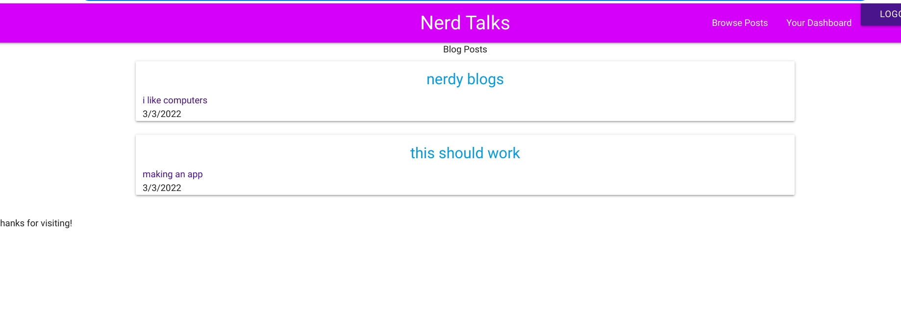
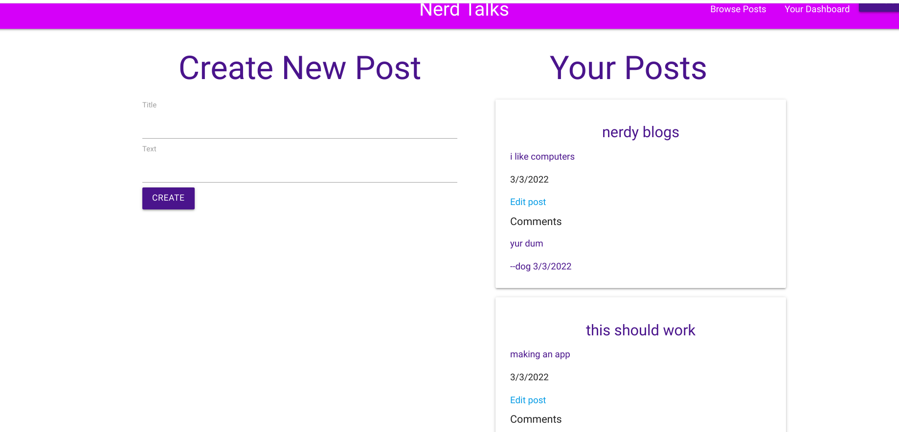

# nerd-talks

## Table of Contents

- [Description](#description)
- [Installation](#installation)
- [Screenshot](#screenshot)
- [Questions](#questions)

## Description

This is a blogging site made with sequelize, express and handlebars. Its done with a model view and controller. you can create read update and delete posts. Currently you can create comments but not delete or update those comments unless you delete the whole post, so thats an area I can improve.

## Installation

Pre-Requisites

MySQL server installed and running

1. Download or clone this repository.
2. On your local machine, open a terminal in the top level directory of the code.
3. On the command line, run npm install to install dependencies.
4. Edit the .env file in the top level directory.
5. Enter your username in DB_USER and password in DB_PW for MySQL, then save the file
6. On the command line, run npm run schema. When prompted for a password, end your MySQL password. You will need to edit package.json if your username is not root.
7. Run npm run start to start the server.

## Screenshot

Here is a screenshot of it on the homepage

And here is a screenshot of it on the dashboard.

## Questions

If you have any questions please check out [my github](https://github.com/Naomilounsbury/nerd-talks) Also here is the application deployed on [heroku](https://peaceful-peak-54805.herokuapp.com/)
